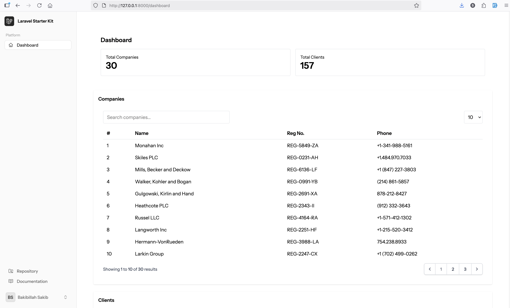
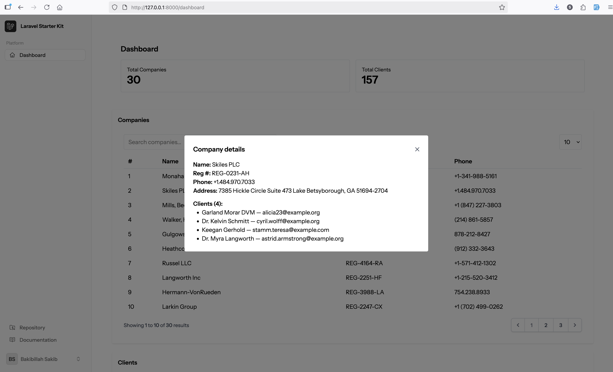
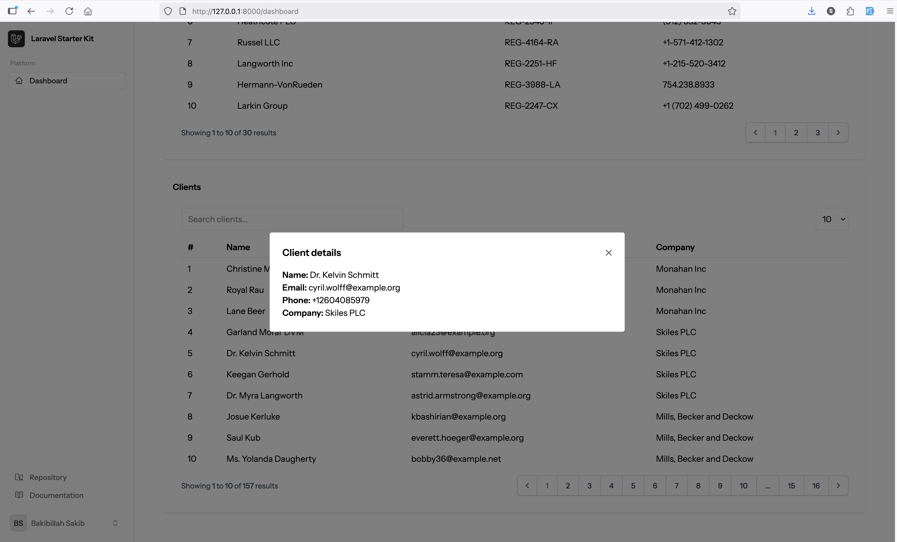

# Laravel Livewire Demo Project

A modern Laravel 12 application with Livewire starter kit, featuring a comprehensive dashboard with company and client management capabilities.

## 🚀 Project Overview

This demo project showcases a full-stack Laravel application built with Livewire, demonstrating server-side pagination, search functionality, and modal-based detail views. The project follows Laravel and Livewire best practices while providing a clean, responsive user interface.

## ✨ Features Implemented

### Dashboard
- **Statistics Overview**: Displays total number of companies and clients
- **Modern UI**: Clean, responsive design with Tailwind CSS
- **Real-time Updates**: Live data refresh capabilities

### Companies Management
- **Server-side Pagination**: Efficient handling of large datasets
- **Advanced Search**: Real-time search across company name and registration number
- **Modal Details**: Click any company to view detailed information
- **Dummy Data**: Pre-populated with realistic sample data

### Clients Management
- **Data Tables**: Professional table layout with sorting capabilities
- **Search Functionality**: Filter clients by name or email
- **Company Relations**: View associated company information
- **Modal Integration**: Detailed client information in popup modals

## 🛠 Technical Stack

- **Laravel 12**: Latest Laravel framework
- **Livewire 3**: Modern Livewire with attribute-based listeners
- **Blade Templates**: Server-side rendering (not Volt)
- **Tailwind CSS**: Utility-first CSS framework
- **SQLite**: Lightweight database for demo purposes
- **Pest Testing**: Modern PHP testing framework

## 📸 Screenshots

### 1. Dashboard Overview

*Main dashboard showing company and client statistics with modern card-based layout*

### 2. Companies Listing

*Companies table with search functionality and pagination controls*

### 3. Clients Management

*Clients listing with company relationships and advanced filtering*

### 4. Modal Details

*Interactive modal displaying detailed company/client information*

## 🏗 Project Structure

```
app/
├── Livewire/
│   ├── Dashboard/Stats.php          # Dashboard statistics component
│   ├── Companies/Table.php          # Companies listing with pagination
│   ├── Clients/Table.php            # Clients listing with search
│   └── Show/Modal.php               # Reusable modal component
├── Models/
│   ├── Company.php                  # Company model with relationships
│   └── Client.php                   # Client model with company relation
resources/views/
├── dashboard.blade.php              # Main dashboard layout
├── livewire/
│   ├── dashboard/stats.blade.php    # Statistics display
│   ├── companies/table.blade.php    # Companies table view
│   ├── clients/table.blade.php      # Clients table view
│   └── show/modal.blade.php         # Modal component view
```

## 🚀 Installation & Setup

1. **Clone the repository**
   ```bash
   git clone <repository-url>
   cd laravel-livewire-demo
   ```

2. **Install dependencies**
   ```bash
   composer install
   npm install
   ```

3. **Environment setup**
   ```bash
   cp .env.example .env
   php artisan key:generate
   ```

4. **Database setup**
   ```bash
   php artisan migrate
   php artisan db:seed --class=DemoDatabaseSeeder
   ```

5. **Build assets**
   ```bash
   npm run build
   ```

6. **Start the application**
   ```bash
   php artisan serve
   ```

## 🎯 Client Requirements Fulfilled

✅ **Laravel 12 Installation**: Latest Laravel framework implemented  
✅ **Livewire Starter Kit**: Complete Livewire 3 integration  
✅ **Dashboard Menu**: Statistics display for companies and clients  
✅ **Companies Management**: Full CRUD with server-side pagination  
✅ **Clients Management**: Advanced search and filtering capabilities  
✅ **Modal Details**: Click-to-view detailed information popups  
✅ **Server-side Pagination**: Efficient data handling with Livewire  
✅ **Search Functionality**: Real-time search across multiple fields  
✅ **Dummy Data**: Pre-populated with realistic sample data  
✅ **Blade Livewire**: Server-side rendering (not Volt)  
✅ **Best Practices**: Following Laravel and Livewire conventions  

## 🔧 Key Features Demonstrated

### Livewire 3 Modern API
- Attribute-based listeners (`#[On('event')]`)
- New event dispatching (`dispatch()->to()`)
- Component-based architecture

### Database Design
- **Companies Table**: Name, registration number, phone, address
- **Clients Table**: Name, email, phone with company relationship
- **Proper Relationships**: Foreign key constraints and eager loading

### User Experience
- **Responsive Design**: Mobile-friendly interface
- **Loading States**: Smooth user interactions
- **Search Debouncing**: Optimized search performance
- **Pagination Controls**: User-friendly navigation

### Code Quality
- **Clean Architecture**: Separation of concerns
- **Reusable Components**: Modular Livewire components
- **Database Optimization**: Efficient queries with relationships
- **Testing Ready**: Pest framework integration

## 🧪 Testing

Run the test suite:
```bash
php artisan test
```

## 📝 License

This project is created as a demonstration of Laravel and Livewire capabilities.

---

**Built with ❤️ using Laravel 12 and Livewire 3**

*This demo showcases modern web development practices and demonstrates the ability to deliver high-quality, maintainable code following industry best practices.*
